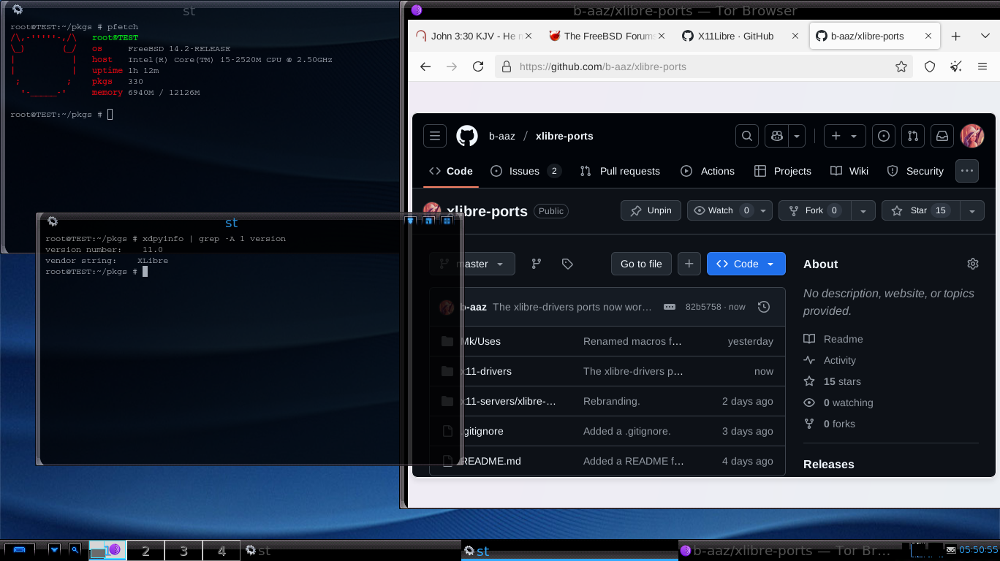
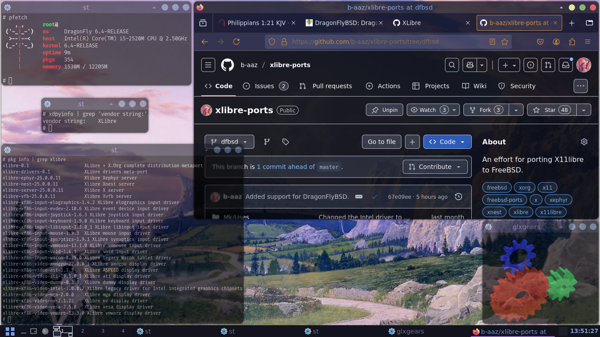

# Porting XLibre to FreeBSD and DragonFlyBSD!

## An effort for porting [XLibre](https://github.com/X11Libre) to FreeBSD and DragonFlyBSD.

---

### XLibre running on FreeBSD:


### XLibre running on DragonFlyBSD:



## Installation:

### Introduction
The XLibre ports are available both in the form of binary packages and a ports 
tree overlay.

### Installing the packages from overlay:

The ports tree overlays are a lesser known feature of the FreeBSD port system
that allows the user to add custom ports on top of the main ports tree (i.e.
*overlay* them). These overlays hold the same structure as the main tree.
This repository's root folder is an overlay and thus acts like a small "ports
tree".

#### Cloning this repository and enabling it as an overlay:

To enable an overlay its path needs to be added to the `OVERLAYS` variable in
the system's make.conf.

To use this repository as an overlay, you should first clone it and move into
it:

```sh
git clone https://github.com/b-aaz/xlibre-ports.git
cd xlibre-ports/
```

And then register the current folder as an overlay:
```sh
echo "OVERLAYS=$(pwd)/" >> /etc/make.conf
```

__Note__: Overlays should work from any path, and there is no "standard"
location in [hier(7)](https://man.freebsd.org/cgi/man.cgi?query=hier&sektion=7) for placing them in, but I personally prefer to put
them into a directory named `/usr/local/ports-overlays/`.

#### Installing and updating the main ports tree:

Since overlays are not a complete version of the port system it is essential
that the main ports tree be present on the system for them to function.

The TL;DR version of how this should be done is:

##### On FreeBSD:
```sh
git clone --depth 1 https://git.FreeBSD.org/ports.git -b 2026Q2 /usr/ports
```
For more information see: [FreeBSD Handbook - Installing the Ports Collection](https://docs.freebsd.org/en/books/handbook/ports/#ports-using-installation-methods).

##### On DragonFlyBSD:
```sh
cd /usr
make dports-create-shallow
```
For more information see: [DragonFlyBSD Documentation - DPortsUsage](https://www.dragonflybsd.org/docs/howtos/DPortsUsage/#index14h2).

__Important note__: This repository includes modified versions of ports form the
latest quarterly branch of the FreeBSD ports tree, and it should only be used
on FreeBSD with this branch installed. To find out how to update your tree to
an specific version please read the above sources. The current quarterly branch
which is being followed is __2026Q2__.

After you made sure that your system's main ports tree is up-to-date, and you
have enabled this repository as an overlay, you can use this tree just like the
main ports tree:

#### Installing a single port: 

To build and install a single port:

```sh
# Move into the port's directory
cd x11-server/xlibre-server
# Clean, build, and install it.
make clean install
```

This will build and install the xlibre-server port on your system.

#### Batch building:

To build everything in this repo just run `make` in the root of this overlay:

```sh
make clean
make
```

__Note__: You should always run `make clean` after building a port or before
starting a new build.

__Tip__: [make(1)](https://man.freebsd.org/cgi/man,cgi?query=make&sektion=1)
targets can be chained; The above command can be shortened to just: `make clean
all`

To generate packages for all the ports in this overlay run:

```sh
PACKAGES=/tmp/xlibre-pkgs make package 
```

__Note__: The folder given to PACKAGES needs to exist.

You can also run these commands in a category's directory:

```sh
cd x11-servers
make
```

This will build only the ports in this overlay under the `x11-servers` category.


You can take a look at the man page [ports(7)](https://man.freebsd.org/cgi/man.cgi?query=ports&sektion=7) and the top of [bsd.port.mk](https://cgit.freebsd.org/ports/tree/Mk/bsd.port.mk) for more information about available `make` targets.

#### Doing a debug build:

This is useful for debugging issues, bugs and getting better stack traces. All
that is needed is to add the following line to your `make.conf` before building
the ports:

```sh
echo "WITH_DEBUG=YES" >> /etc/make.conf
```

---

### Installing the binary packages from CI artifacts:

There are no CI builds as of now due to CirrusCI's shutdown.

## Setting up drivers:

__This section is currently:__ `==>` 


Installing the video card drivers should be followed as instructed in the
 [FreeBSD handbook's Section 5.2 Graphic Drivers]( https://docs.freebsd.org/en/books/handbook/x11/#x-graphic-card-drivers ).
 Just swap the X.Org versions of the drivers in guide with the XLibre versions
 of the ports provided by this repository.
 
## How to help this project:

1) Build and test these ports on various hardware platforms.
2) Find bugs in these ports and report them, or create PRs for them.
4) Star this repository.
3) Donate with BTC: `bc1qjax34x5277g5d4zfltxf59ddk7qrr90w4x0le3`
(XMR will be added soon)

---


